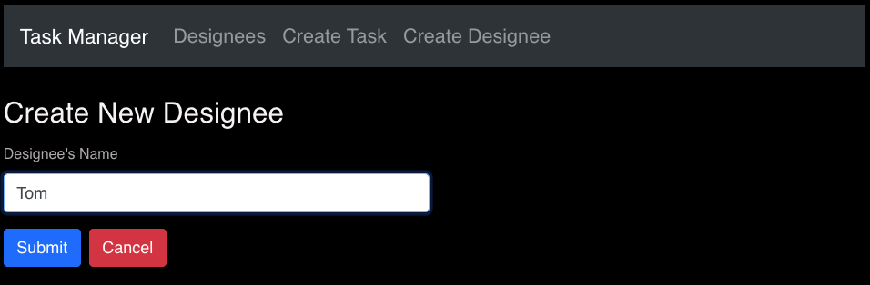
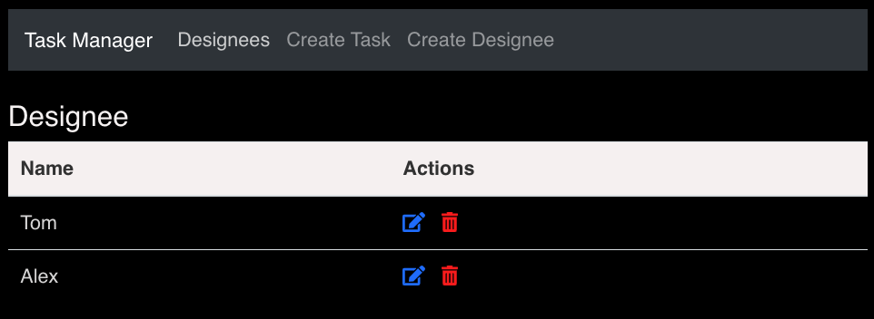
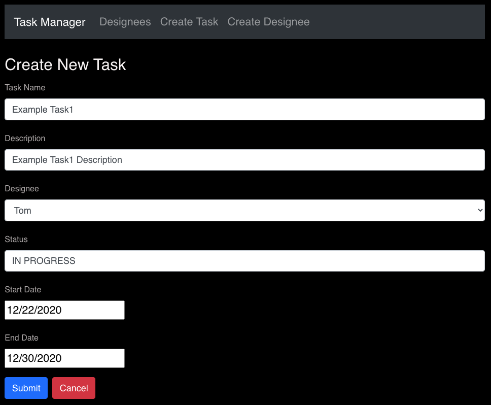
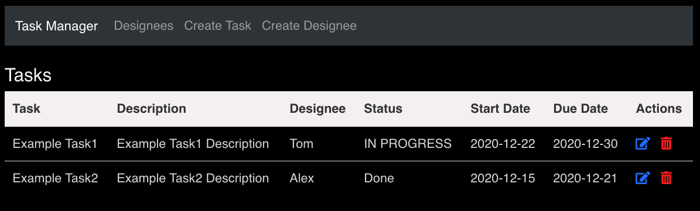

# Task_Manager
This is a single-page application that can help people manage tasks. 
It is created with the MongoDB, Express, React, Node.js (MERN) stack.

## Demonstration
* **Create designee:** Create a designee to take care of tasks.

* **Designees:** Show current designees created by the user.

* **Create tasks:** Create a Task and appoint someone to it. 

* **Task Manager:** Show current Tasks information.

## Directory Structure

    Task-Manager
    ├── README.md
    │
    ├── frontend              
    │   └─── src 
    │        ├── index.js
    │        ├── App.js
    │        ├── package.json         # NPM Package file
    │        └── components           # React components
    │           
    │
    └── backend
        ├── server.js                 
        ├── package.json              # NPM Package file
        ├── .env                      # Environment variables file
        ├── routes                    # Backend routes files
        └── models                    # MongoDB schema files
